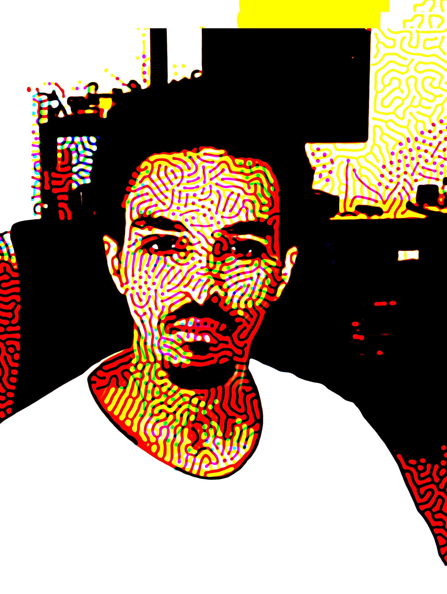
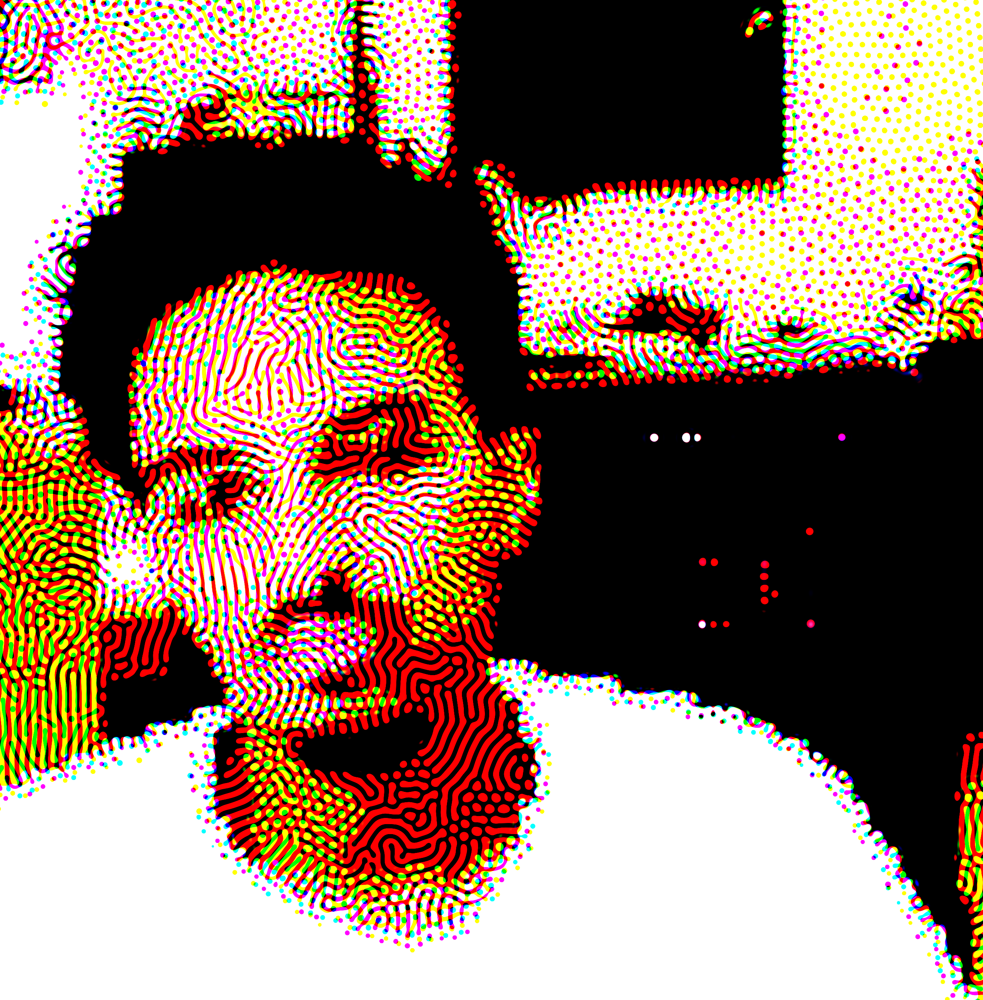

# CMYK Reaction Diffusion Cam

A real-time generative art tool that transforms your webcam feed into layered CMYK reaction-diffusion patterns using GPU shaders.

Inspired by printmaking, cellular automata, and visual computing, this system creates organic, evolving textures in the CMYK colour model, using your live camera stream as input.

---

## Features

- 🟡 **CMYK Simulation**  
  Each channel (Cyan, Magenta, Yellow, Black) runs a separate reaction-diffusion process for layered output.
  
- 🎥 **Live Camera Input**  
  The webcam feed is sampled and analysed in real time, feeding motion and luminance into the simulation.

- 🧪 **Edge & Brightness Influence**  
  Patterns are influenced by edges and lighting in the video stream for dynamic, responsive visuals.

- 🖼️ **SVG/PNG Export**  
  Save final results as raster images or as vectorised SVGs (split by CMYK channels) for plotting or printing.

- 🎛️ **Parameter Control**  
  Includes presets and sliders for tuning diffusion rates, brush effects, zoom, and colour sharpening.

- 🎧 **(Optional) Audio-Reactive Mode**  
  Use a microphone input to modulate pattern speed and density via audio amplitude.

- ⚙️ **WebGL2 Shader Architecture**  
  All simulations are computed on the GPU using fragment shaders for maximum speed and detail.

---

## How It Works

The core is a GPU implementation of the [Gray-Scott reaction-diffusion model](https://en.wikipedia.org/wiki/Reaction–diffusion_system), applied independently to four simulated chemical fields corresponding to C, M, Y, and K pigment channels. Each layer evolves according to its own set of `feed`, `kill`, and `diffusion` parameters, optionally reacting to input data such as:

- Luminance and edge detection from live video input  
- User-controlled brush strokes  
- Audio signals for rhythmical motion  

The results are composited using a CMYK-to-RGB conversion to produce vibrant, print-inspired visuals.

---

## Installation

Open `index.html` in a modern browser (Chrome recommended).  
Make sure the browser supports **WebGL2** and runs over HTTPS (or localhost) to access the webcam.

No build step or external dependencies are required.

---

## Controls

- `Zoom`: Adjust camera input zoom  
- `Contrast`: Increase or decrease contrast of input frame  
- `Brush Size` / `Strength`: Draw into the simulation with a virtual brush  
- `Edge Influence` / `Brightness Influence`: Adjust how input image affects pattern formation  
- `Pattern Presets`: Choose from styles like Maze, Coral, Spots, etc  
- `Export`: Save PNGs or SVGs (by channel)  

---

## Examples

| Live Feed → CMYK Reaction-Diffusion Output |
|-------------------------------------------|
|  |
|  |
|  |

---

## Credits

Created by **[Samer Dabra](https://hello.spongenuity.com)**  
Shader architecture, camera logic, and parameter handling developed from scratch for WebGL2.

---

## License

MIT License. Feel free to fork, remix, or build upon this project for creative or educational use.

---

## TODO

- [ ] Add user interface for channel-specific tuning  
- [ ] Publish NPM/WebComponent version  
- [ ] Enable recording video exports  
- [ ] Add audio-reactive presets with music

